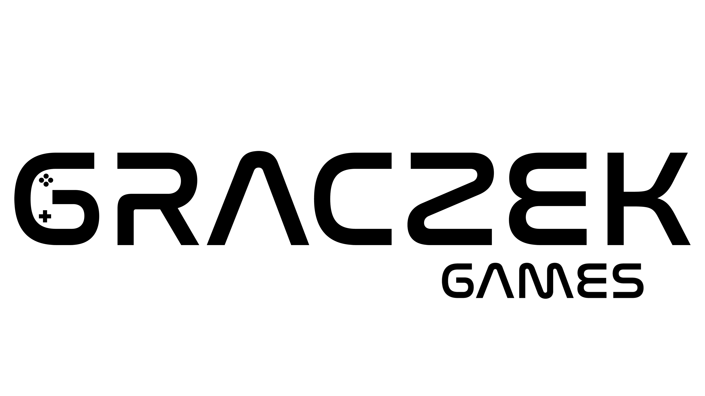
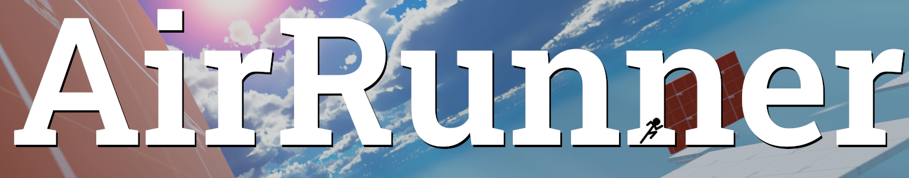

### Hi there 👋
I'm a computer science student at the Silesian University of Technology, passionate about game development with game publishing experience.
I love learning new programming languages and skills for self-development.

Skills: C++/C#/Unity/SFML

As a solo game-dev I'm known as GraczekGames  
 
I have loads of projects done using Unity game engine and C#. Two of them are published.  

My first published game is a first person parkour game with online leaderboard - AirRunner: 

[Link to AirRunner](https://graczek.itch.io/airrunner)

My second game is a mobile, hypercasual game JellyBounce: 

[Link to JellyBounce](https://play.google.com/store/apps/details?id=com.Graczek.JellyBounce) 

<!--
**Fijalkowskim/Fijalkowskim** is a ✨ _special_ ✨ repository because its `README.md` (this file) appears on your GitHub profile.

Here are some ideas to get you started:

- 🔭 I’m currently working on ...
- 🌱 I’m currently learning ...
- 👯 I’m looking to collaborate on ...
- 🤔 I’m looking for help with ...
- 💬 Ask me about ...
- 📫 How to reach me: ...
- 😄 Pronouns: ...
- ⚡ Fun fact: ...
-->
